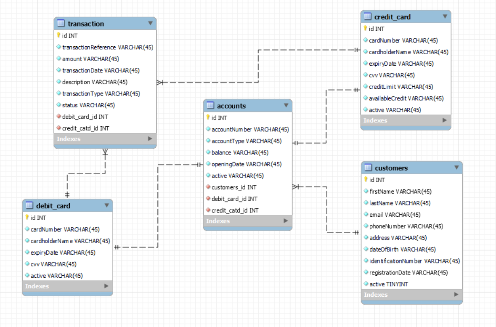

# Banking Service REST API

A comprehensive RESTful banking service built with Spring Boot that manages customers, accounts, cards, and transactions with full CRUD operations.

## Features
- Complete customer management (create, retrieve, update, delete)
- Account management with different account types (Savings, Current)
- Credit and Debit card issuance and management
- Transaction processing and history
- Comprehensive validation and exception handling
- Secure API endpoints
- Detailed API documentation with Swagger/OpenAPI

## Tech Stack
- **Spring Boot** - Core framework
- **Spring Data JPA** - Data persistence
- **Spring Validation** - Input validation
- **H2/MySQL** - Database options
- **Swagger/OpenAPI** - API documentation
- **Maven** - Dependency management
- **SonarQube** - Code quality
- **JaCoCo** - Code coverage
- **ModelMapper** - Object mapping
- **SLF4J** - Logging

## Domain Model
### Core Entities
- **Customer** - Stores customer details
- **Account** - Represents bank accounts linked to customers
- **AccountType** - Enumeration of account types (SAVINGS, CURRENT)
- **DebitCard** - Linked to accounts for withdrawals and payments
- **CreditCard** - Provides credit facilities to customers
- **Transaction** - Records financial transactions

## Business Rules
1. Customers can have multiple accounts.
2. A customer cannot have multiple accounts of the same type.
3. Each account can have one debit card and one credit card.
4. Cards can have multiple transactions.
5. Proper validation ensures data integrity.

## Prerequisites
- JDK 17 or higher
- Maven 3.8+
- MySQL (optional, can use H2 in-memory by default)

## Installation

### Clone the repository:

```bash
https://github.com/tusharishere/banking-service.git
cd banking-service
```

### Build the project:

```bash
mvn clean install
```

### Run the application:

```bash
mvn spring-boot:run
```


## API Documentation
Once the application is running, you can access the Swagger UI documentation at:

```
http://localhost:8080/swagger-ui.html
```
## E-R Diagram




